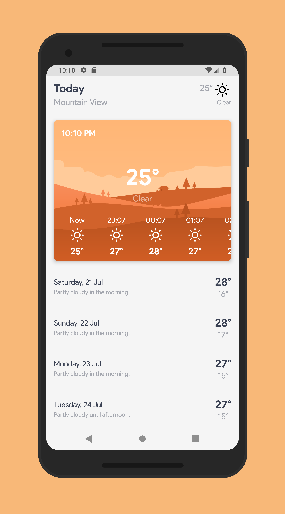
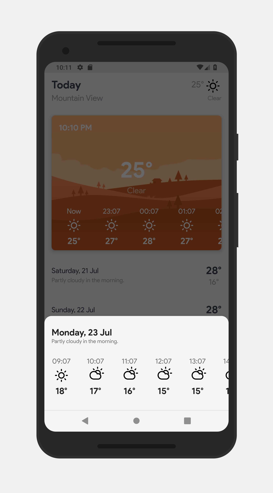
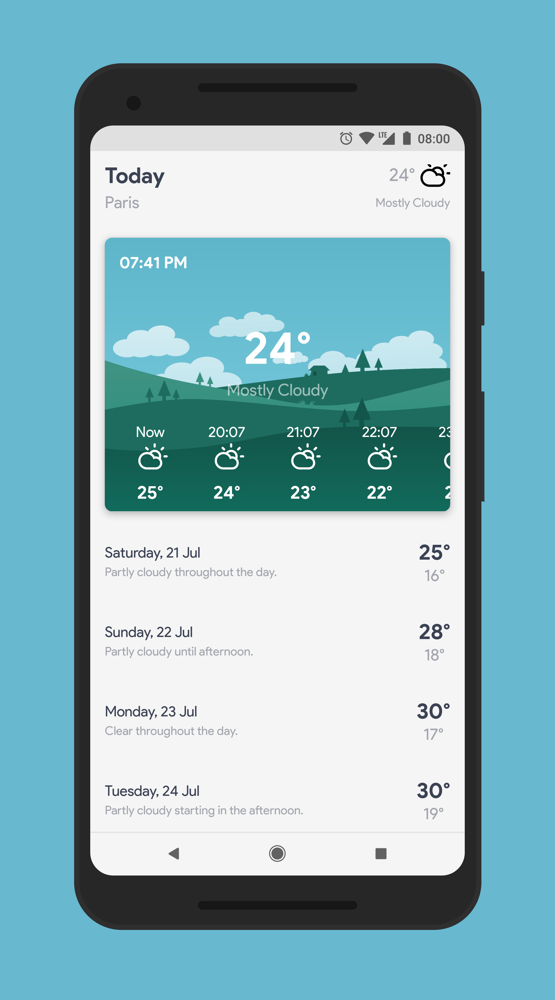
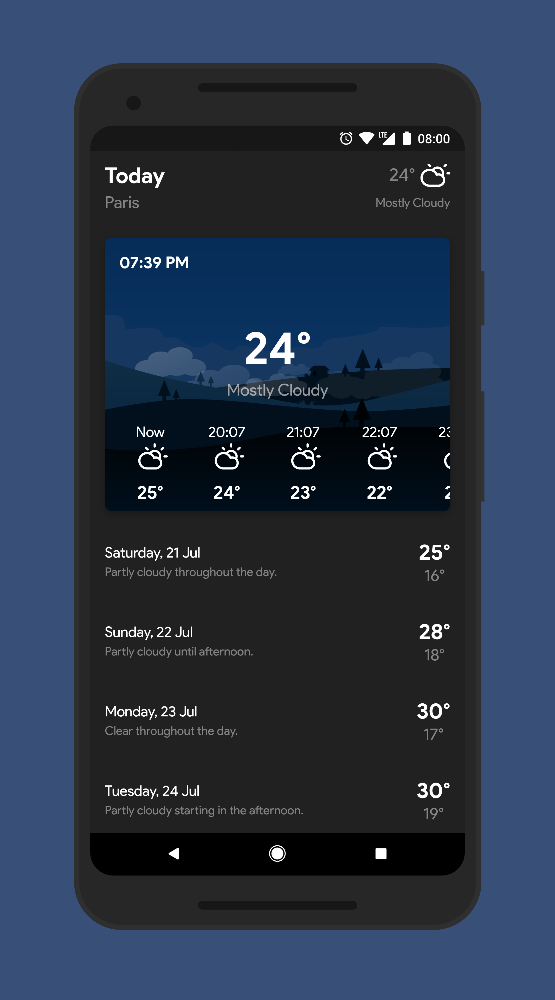

# Lite Weather 
Android weather forecast app

[](https://circleci.com/gh/TinasheMzondiwa/WeatherApp/tree/master)

Original design by [Satheesh Kumar](https://www.uplabs.com/posts/weather-app-845554cf-c0e9-4819-b338-055020ad2acb)

## Screenshots 


**[Install on Google Play](https://play.google.com/store/apps/details?id=com.tinashe.weather)**


Weather data [Powered by Dark Sky](https://darksky.net)

## Technologies used
* Kotlin
* Retrofit
* Android Architecture Components 
* Dagger
* Lottie

## Keys needed to build project
1. [Dark Sky](https://darksky.net) API KEY
2. [Play Services](https://developers.google.com/places/android-sdk/) API KEY
3. Your own background images
* Edit the `gradle.properties` file and include your own:
```
DARK_SKY_API_SECRET="KEY"
PLACES_API_KEY=KEY
CLEAR_DAY="IMG_URL"
CLEAR_NIGHT="IMG_URL"
CLOUD_DAY="IMG_URL"
CLOUD_NIGHT="IMG_URL"
RAIN_DAY="IMG_URL"
RAIN_NIGHT="IMG_URL"
LIGHTNING_DAY="IMG_URL"
LIGHTNING_NIGHT="IMG_URL"
SNOW_DAY="IMG_URL"
SNOW_NIGHT="IMG_URL"
```


## License

    Copyright 2018 Tinashe Mzondiwa

    Licensed under the Apache License, Version 2.0 (the "License");
    you may not use this file except in compliance with the License.
    You may obtain a copy of the License at

       http://www.apache.org/licenses/LICENSE-2.0

    Unless required by applicable law or agreed to in writing, software
    distributed under the License is distributed on an "AS IS" BASIS,
    WITHOUT WARRANTIES OR CONDITIONS OF ANY KIND, either express or implied.
    See the License for the specific language governing permissions and
    limitations under the License.
